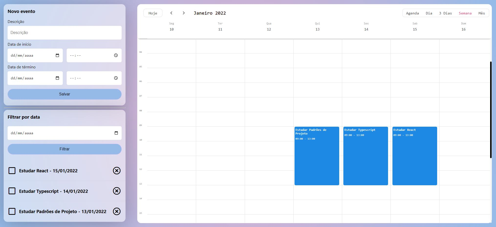

# Calendar Of Events

This is an event calendar project developed in React with TypeScript. The application allows you to create and manage events, whether for personal or professional use.

Included features:

* Add events with description, date and start and end time.
* Exclude events.
* Filter events by date.
* Interactive calendar with options to view by schedule, day, every 3 days, week or month.
* Drag and drop events onto the calendar to interactively adjust them.

This events calendar was created to offer an easy and intuitive experience in organizing and keeping track of your appointments. With the ability to filter events and view a large calendar, you'll have a clear, organized view of your schedule.

# Demonstrative Image

# Technologies Used

* React with TypeScript: React is a widely used JavaScript library for building interactive user interfaces. TypeScript is a superset of JavaScript that adds static typing to code, bringing benefits such as greater security and productivity in development. The combination of React and TypeScript allows you to write more robust code, identify errors at compile time and facilitate project maintenance.

* Recoil library: Recoil is a library used for state management in React applications. It simplifies and improves the management of data shared between components, providing a reactive and efficient solution. With Recoil, you can create and share states decoupled, ensuring accurate updates and avoiding common issues like prop drilling.

* Json Server Library: Json Server is a library that allows you to create a simulated REST API from a JSON file. It provides endpoints for data manipulation such as create, read, update, and delete (CRUD). In the project, Json Server is used to simulate an API and provide the necessary data for the event schedule. In this way, it is possible to test the application without the need for a complete backend.

These technologies were selected to offer a modern, productive and efficient development environment. React with TypeScript lets you build reactive, statically typed user interfaces, while Recoil simplifies state management between components. Json Server, in turn, simulates a REST API to provide data to the application, facilitating development and testing.

# How to Use

* Download the code and run it in your favorite code editor by following the steps below:

    1 - Install Node.Js 18 (or higher) from the official website https://nodejs.org/, if not installed.

    2 - Use the command "npm i" in the terminal to install all necessary dependencies.

    3 - Use the command "npm install -g json-server" in the terminal to install Json Server.

    4 - Use the command "json-server --watch db.json -p 8080" in the terminal to access Json Server
    
    5 - Use the command "npm start" in the terminal to open the web system in your browser in http://localhost:3000

# Expansion

With this code base, you will be able to further expand the functionalities of this web system, as you will always have functionalities to add and refine errors, test, creating your own functionalities according to your needs.

